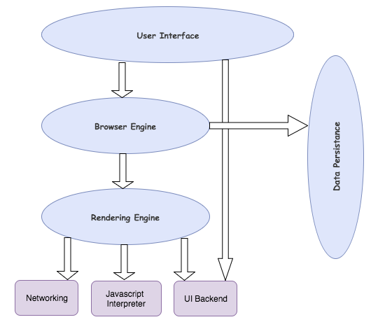

## What is the main functionality of the browser

- The browser tries to figure out the IP address for the entered domain. The DNS lookup proceeds as follows:
    - Browser cache: The browser caches DNS records for some time. Interestingly, the OS does not tell the browser the time-to-live for each DNS record, and so the browser caches them for a fixed duration (varies between browsers, 2 – 30 minutes).
    - OS cache: If the browser cache does not contain the desired record, the browser makes a system call (gethostbyname in Windows). The OS has its own cache.

- The browser checks the cache for a DNS record to find the corresponding IP address of desired URL.
    - DNS(Domain Name System) is a database that maintains the name of the website (URL) and the particular IP address it links to. Every single URL on the internet has a unique IP address assigned to it. The IP address belongs to the computer which hosts the server of the website we are requesting to access
    - The primary purpose of DNS is human-friendly navigation. Makes life easier by not having to remember the IP of everything
- If the requested URL is not in the cache, ISP’s DNS server initiates a DNS query to find the IP address of the server that hosts
    - The purpose of a DNS query is to search multiple DNS servers on the internet until it finds the correct IP address for the website
- The browser initiates a TCP connection with the server.
    - Once the browser receives the correct IP address, it will build a connection with the server that matches the IP address to transfer information. Browsers use internet protocols to build such connections. There are several different internet protocols that can be used, but TCP is the most common protocol used for many types of HTTP requests.
- The browser sends an HTTP request to the webserver.
    - broswer usually makes an API request for the same 
- The server handles the request and sends back a HTTP response.
- The browser displays the HTML content (for HTML responses, which is the most common).

## High Level Components of a browser

1. **The User Interface**: The user interface is the space where User interacts with the browser. It includes the address bar, back and next buttons, home button, refresh and stop, bookmark option, etc. Every other part, except the window where requested web page is displayed, comes under it.

2. **The Browser Engine**: The browser engine works as a bridge between the User interface and the rendering engine. According to the inputs from various user interfaces, it queries and manipulates the rendering engine.

3. **The Rendering Engine**: The rendering engine, as the name suggests is responsible for rendering the requested web page on the browser screen. The rendering engine interprets the HTML, XML documents and images that are formatted using CSS and generates the layout that is displayed in the User Interface. However, using plugins or extensions, it can display other types data also. Different browsers user different rendering engines:
    - Internet Explorer: Trident
    - Firefox & other Mozilla browsers: Gecko
    - Chrome & Opera 15+: Blink
    - Chrome (iPhone) & Safari: Webkit
  

4. **Networking** : Component of the browser which retrieves the URLs using the common internet protocols of HTTP or FTP. The networking component handles all aspects of Internet communication and security. The network component may implement a cache of retrieved documents in order to reduce network traffic.

5. **JavaScript Interpreter**: It is the component of the browser which interprets and executes the javascript code embedded in a website. The interpreted results are sent to the rendering engine for display. If the script is external then first the resource is fetched from the network. Parser keeps on hold until the script is executed.

6. **UI Backend**: UI backend is used for drawing basic widgets like combo boxes and windows. This backend exposes a generic interface that is not platform specific. It underneath uses operating system user interface methods.

7. **Data Persistence/Storage**: This is a persistence layer. Browsers support storage mechanisms such as localStorage, IndexedDB, WebSQL and FileSystem. It is a small database created on the local drive of the computer where the browser is installed. It manages user data such as cache, cookies, bookmarks and preferences.

## Rendering engine and its use.
- The networking layer will start sending the contents of the requested documents to the rendering engine in chunks of 8KBs.
- The rendering engine parses the chunks of HTML document and convert the elements to DOM nodes in a tree called the “content tree” or the “DOM tree”. It also parses both the external CSS files as well in style elements.
- While the DOM tree is being constructed, the browser constructs another tree, the render tree
    - It is the visual representation of the document. The purpose of this tree is to enable painting the contents in their correct order
- After the construction of the render tree, it goes through a “layout process” of the render tree. When the renderer is created and added to the tree, it does not have a position and size. The process of calculating these values is called layout or reflow. This means giving each node the exact coordinates where it should appear on the screen
- The next stage is painting. In the painting stage, the render tree is traversed and the renderer’s “paint()” method is called to display content on the screen. Painting uses the UI backend layer.

## Parsers (HTML, CSS, etc)
- HTML content at the beginning which goes through a process called tokenization, tokenization is a common process in almost every programming language where code is split into several tokens which are easier to understand while parsing. This is where the HTML's parser understands which is the start and which is the end of the tag, which tag it is and what is inside the tag.
- Now we know, html tag starts at the top and then the head tag starts before the html ends so we can figure out that the head is inside html and create a tree out of it. Thus we then get something called a parse tree which eventually becomes a DOM tree

## Script Processors
- Used to parse and execute JavaScript code which is present in the web page
- **Script** tag is used to specify the JS code in HTML
- this is where the variables are declared and the code to manipulate DOM can be written

## Tree construction

- The CSSOM and DOM trees are combined into a render tree, which is then used to compute the layout of each visible element and serves as an input to the paint process that renders the pixels to screen
- The rendering engine parses the chunks of HTML document and convert the elements to DOM nodes in a tree called the “content tree” or the “DOM tree”. It also parses both the external CSS files as well in style elements.
- While the DOM tree is being constructed, the browser constructs another tree, the render tree
    - It is the visual representation of the document. The purpose of this tree is to enable painting the contents in their correct order
- HTML is converted into a DOM tree with nodes and CSS is converted into a CSSOM tree.
- CSSOM is painted over the DOM tree by matching relevant NODE’s of the DOM tree

## Order of script processing
- The script HTML element is used to embed executable code or data. it is typically used to embed or refer to JavaScript code.
    - **async** - For classic scripts, if the async attribute is present, then the classic script will be fetched in parallel to parsing and evaluated as soon as it is available.
    - **crossorigin** - Normal script elements pass minimal information to the window.onerror for scripts which do not pass the standard CORS checks.
    - **defer** - This Boolean attribute is set to indicate to a browser that the script is meant to be executed after the document has been parsed, but before firing DOMContentLoaded.

## Layout and Painting
- In the painting stage, the render tree is traversed and the renderer’s “paint()” method is called to display content on the screen. Painting uses the UI backend layer.